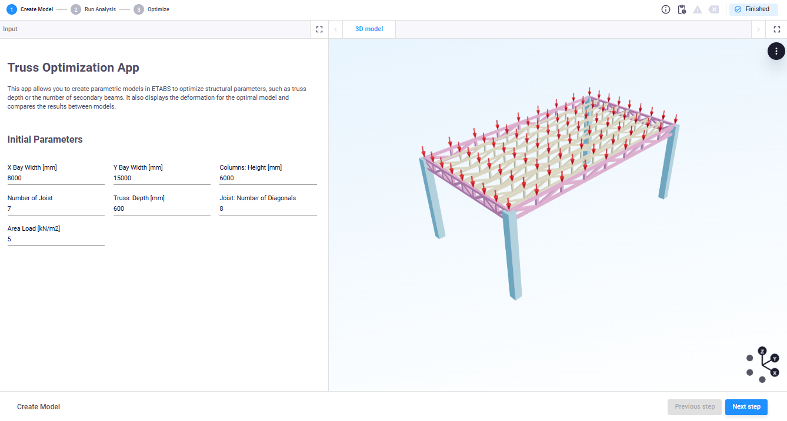
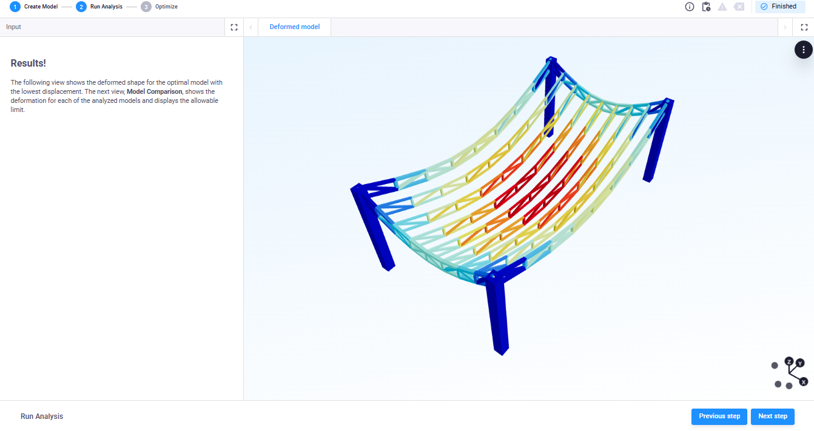
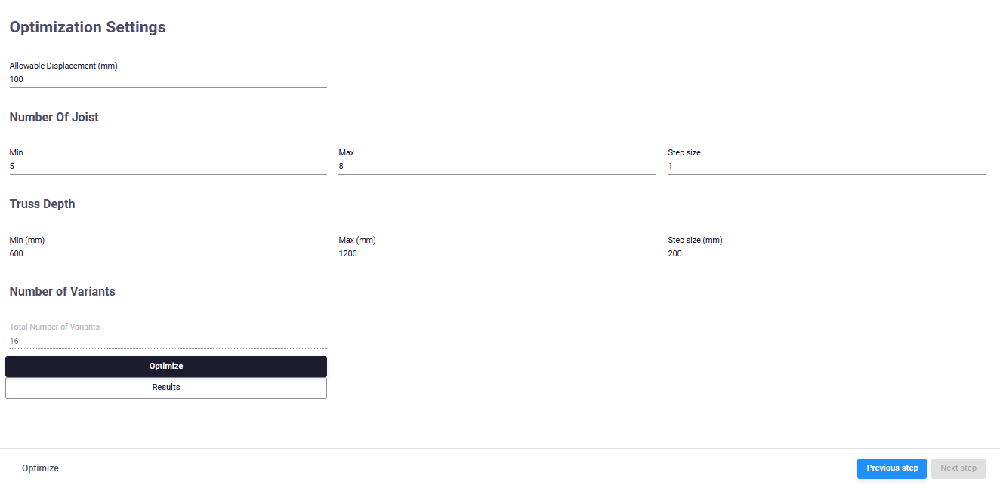
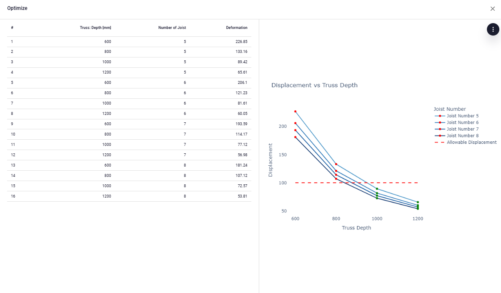

# ETABS Truss Parameterization App

This template app demonstrates how to create a structure in ETABS with multiple trusses, allowing variations to parameters such as the number of diagonals, bay width and length, truss depth, and column height. An area load is applied to the top beam nodes, which can also be modified.

The app includes two optimization features: one for optimizing either the number of joists or secondary beams, and the other for optimizing truss depth.

The app follows these three steps:

## First Step
As shown in the image below, users can set the initial parameters. They can adjust the width of the structure’s bay along the x and y axes, as well as the column height. The number of joists, truss depth, and diagonal configurations are also adjustable. Finally, an area load with a customizable magnitude is applied to the structure’s top nodes.

The parameters set in this step will be used to run the analysis in ETABS for the current configuration. In the second step, the user will see the deformed shape of the analyzed structure.

## Second Step
The second step triggers the calculation of the structure. An ETABS model is created using the API with the geometry and loads defined in the previous step. After the calculation, the results are displayed in the app, as shown in the image below.

### Third Step
In this step, users can define settings to optimize two parameters: truss depth and the number of joists. These settings include minimum and maximum values for joist numbers, truss depth, and a corresponding variation delta. Users can also set an allowable displacement threshold to identify models that fall below this limit.

After setting up all the optimization parameters, the app calculates the number of model variations required. When the optimization button is triggered, each model variation is created in ETABS, and the results are stored and displayed back in the app.

After creating and analyzing the structural models, the app provides a visualization table that displays deformation values associated with the optimization parameters (joist number and truss depth). Additionally, a plot showing deformation vs. truss depth (grouped by joist number) helps users select the optimal model and understand the optimization process. Models that meet the criteria are marked with green dots, while those that do not are marked in red, as shown in the images below.

